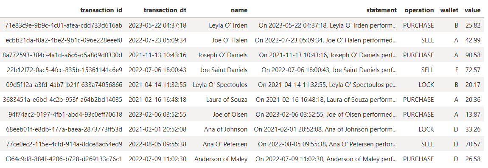

# PySparkGenerateTransactionsDataset
Simple PySpark notebook ran in `Azure Synapse Spark Pool` to mock a denormalized CSV file with transaction data. Used some basic tricks to mock the data in the absence of the `Fake` module. 

Generated basic 10MM record CSV with the following structure, with output pointing to the ADLSGen2 Storage Account.

```
[
    'transaction_id',
    'transaction_dt',
    'name',
    'statement',
    'operation',
    'wallet',
    'value'
]
```

### Dataset example:


